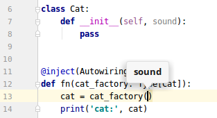

Wirinj
======
A new dependency injection library for Python 3 with an original and clean design.

Why another dependency injection library?
-----------------------------------------

Working on a large project I tried out [python-dependency-injector](https://github.com/ets-labs/python-dependency-injector) first.
Then, I decided to switch to [pinject](https://github.com/google/pinject).
As none of them had the features I wanted, I finally decided to write my own library to meet my needs:

- Minimal boiler plate code.
- Avoiding dependencies to the injection library itself.
- Friendly with [IDE](https://en.wikipedia.org/wiki/Integrated_development_environment)'s [code completion](https://www.jetbrains.com/help/pycharm/auto-completing-code.html#) (e.g. with [PyCharm](https://www.jetbrains.com/pycharm/)).
- Using [reflection](https://en.wikipedia.org/wiki/Reflection_(computer_programming)#Python) to detect dependencies automatically.
- Easy to define and use of factories.
- Autowiring option.
- Easy to fix dependency problems.
- Detailed injection reports.
- Powerful but simple wiring configuration.
- Avoiding naming conventions.
- Detection of [type annotations](https://docs.python.org/3/library/typing.html).
- [Private injection](#private-injection).
- Open and extendable architecture.

Installation
------------

python >= 3.5

```shell
$ pip install wirinj
```

Minimal example
---------------

[minimal.py](./examples/basic/minimal.py):

```python
from wirinj import Injector, Autowiring

class Cat:
    pass

inj = Injector(Autowiring())

cat = inj.get(Cat)
print(cat)
```

Returns:

```
<__main__.Cat object at 0x7fbe537f52b0>
```

Basic usage
-----------

Example ([basic_usage.py](examples/basic/basic_usage.py)):

```python
from wirinj import Injector, Definitions, Instance, Singleton, Factory

class Cat:
    pass

class Dog:
    pass

# Wiring definitions
defs = {
    'sound': 'Meow',
    Cat: Instance(),
    Dog: Singleton(),
    'cat_factory': Factory(Cat),
}

# Create injector
inj = Injector(Definitions(defs))
```
\
Get a `'sound'`:
```python
sound = inj.get('sound')
print(sound)
```
```
Meow
```
\
Get a `Cat`:
```python
cat1 = inj.get(Cat)
cat2 = inj.get(Cat)

print(cat1)
print(cat2)
print(cat1 is cat2)
```
```
<__main__.Cat object at 0x7fab3ddc2208>
<__main__.Cat object at 0x7fab3c1fa438>
False
```
`Cat` returns different instances each time because it is defined as an `Instance()`.

\
Get the `Dog`:
```python
dog = inj.get(Dog)
dog2 = inj.get(Dog)

print(dog)
print(dog2)
print(dog is dog2)
```
```
<__main__.Dog object at 0x7fab3c1fa748>
<__main__.Dog object at 0x7fab3c1fa748>
True
```
`Dog` always returns the same object because it is defined as a `Singleton()`.

\
Get a `cat factory` and use it to create a new `Cat`:
```python
cat_factory = inj.get('cat_factory')
cat3 = cat_factory()

print(cat3)
```
```
<__main__.Cat object at 0x7fc6a98119b0>
```
`cat_factory` returns a factory because it is defined as a `Factory(Cat)`.

The @inject decorator
-----------------------------

If you are using an [IDE](https://en.wikipedia.org/wiki/Integrated_development_environment) such as [PyCharm](https://www.jetbrains.com/pycharm/), you will notice that [code completion](https://www.jetbrains.com/help/pycharm/auto-completing-code.html#) do not work with the previous example.
The _IDE_ cannot know the type of, for example, `cat1` or `dog`.

You can be IDE-friendly by decorating a function with `@inject`:

Example ([inject_function.py](examples/basic/inject_function.py)):

```python
from wirinj import inject

defs = {
    'sound': 'Meow',
    Cat: Instance(),
    Dog: Singleton(),
    'cat_factory': Factory(Cat),
}

@inject(Definitions(defs))
def fn(cat1: Cat, cat2: Cat, dog: Dog, sound, cat_factory):

    print('sound:', sound)
    print('cat1:, cat1)
    print('cat2:', cat2)
    print('cat1 = cat2: ', cat1 is cat2)
    print('dog:', dog)

    cat3 = cat_factory()
    print('cat3:', cat3)

fn()
```

Returns:

``` 
sound:  Meow
cat1:  <__main__.Cat object at 0x7f675ce5db38>
cat2:  <__main__.Cat object at 0x7f675ce5df28>
cat1 = cat2:  False
dog:  <__main__.Dog object at 0x7f675ce5dac8>
cat3:  <__main__.Cat object at 0x7f675ce72400>
```

`@inject` inspects the arguments of the `fn` function signature and inject the required dependencies.
You get all the needed dependencies through the function arguments.
You type less and it is clearer and IDE friendly.

As `cat1` and `cat2` arguments matches `Cat: Instance()` configuration, two new `Cat` instances are injected.

Simillary, `dog` matches `Dog: Singleton()`.
Therefore, any `Dog` argument will be injected with the same single `Dog`. 

In contrast, for `sound` and `cat_factory`, the configuration entry is matched by __name__ and not by __class__.
This is because, in the wiring configuration `dict`, the __key__ of `'sound': 'Meow'` and `'cat_factory': Factory(Cat)` are of type `string`:

- When the _key_ is a __class__, the injector will look at the __type__ annotation of the argument.
- When the _key_ is a __string__ the injector will look at the __name__ of the argument.


Factories
---------

You can object that, in the previos example, the [code completion](https://www.jetbrains.com/help/pycharm/auto-completing-code.html#) will not work with `cat_factory`.
That's true; fortunately, this can be easily fixed:

#### IDE friendly factories

Just add a type annotation of type `Type[Cat]` to the factory argument:

Example ([ide_friendly_factory.py](examples/basic/ide_friendly_factory.py)):

```python
from typing import Type

class Cat:
    def __init__(self, sound):
        pass

...

@inject(...)
def fn(cat_factory: Type[Cat]):
    cat = cat_factory('Meow')
    print('cat:', cat)

fn()
```

Now, it is recognized by the IDE:



\
`Type[Cat]`, as explained in the [typing](https://docs.python.org/3/library/typing.html#typing.Type) module docs, represents the class `Cat` or a subclass of it:

```python
from typing import Type

class Cat:
    pass

class BlackCat(Cat):
    pass

def func(cat_class: Type[Cat]):
    return cat_class()

print('Cat: ', func(Cat))
print('BlackCat: ', func(BlackCat))
```

Returns:
```
Cat:  <__main__.Cat object at 0x7fc458bc7588>
BlackCat:  <__main__.BlackCat object at 0x7fc458bc7588>
```

### Defining the factory by type

To not be limited to a particular name, such as `cat_factory`, we can define the factory dependency by type.

```python
defs = {
    Type[Cat]: Factory(),
}
```

This way you can name the argument as you like, as long as its type annotation is `Type[Cat]`.
For example: 

```python
@inject(...)
def fn(cats: Type[Cat]):
    cat = cats()
```

Dependency definitions
----------------------

`Definitions` class is a convenient way to configure the wiring of your classes according to a definition `dict`.
Most of the previous examples have made use of a `Definitions` object with a `dict` as an argument.
Now I'm going to explain it in detail.

### Definition format

One or several `dict` define your wiring configuration. 
Each _key_ represents the argument to be injected.
The _value_ represents how is it injected:

```python
defs = {
    Cat: Instance(),
    'dog': Singleton(Dog),
}

inj = Injector(Definitions(defs))
```

### dict keys

- If the _key_ is a `class` it will match the argument's __type__ annotation.
E.g.: the first key in the example above causes any argument of type `Cat`, no matter its name, to be injected with a new _instance_ of `Cat`.

- If the _key_ is a `string` it will match the argument __name__.
E.g.: the second key causes any argument whose name is `'dog'` to be injected with a unique `Dog` instance.
Here, as the class can't be inferred from the key, you need to explicitly provide the class as an argument: `'dog': Singleton(Dog)`.  

### dict values

Each _value_ in the `dict` can be:

- A _literal_ value you want to be injected. E.g. `'db_name': 'my-db'`.
- `Instance`: inject a new instance each time.
- `Singleton`: inject the same single instance every time.
- `Factory`: inject a factory object that can be called to create new objects dynamically.
- `CustomInstance`: similar to `Instance` but you provide a custom function which returns new instances.
- `CustomSingleton`: similar to `Singleton` but you provide a custom function which returns the singleton.
- Other user defined subclasses of `DependencyBuilder` or `Dependency`.

Example ([definition_types.py](examples/basic/definition_types.py)):

```python
def dog_creator():
    """ Custom instantiation """
    ...
    return dog

defs = {
    House: Singleton(),
    Cat: Instance(),
    Type[Cat]: Factory(),
    Dog: CustomInstance(dog_creator),
    Type[Dog]: Factory(),
}

@inject(Definitions(defs))
def fn(house: House, cat_factory: Type[Cat], dog_factory: Type[Dog]):
    cat = cat_factory()
    dog = dog_factory()
    ...    

fn()
```

### Providing a class

`Instance`, `Singleton` and `Factory` accept an optional class argument to specify the class of the object to be created.
You pass the class in two use cases:
- The _key_ is a `string` and therefore the dependency class is undefined.
- The argument is annotated with a _base class_ but you want to provide a _subclass_ of it.

Example of both cases ([explicit_type.py](examples/basic/explicit_type.py)):

```python
class Pet:
    pass
    
class Cat(Pet):
    pass
    
class Dog(Pet):
    pass

defs = {
    'cat': Singleton(Cat),
    Pet: Singleton(Dog),
}

@inject(Definitions(defs))
def fn(cat, pet: Pet):
    print('cat is a', cat.__class__.__name__)
    print('pet is a', pet.__class__.__name__)    
fn()
```

returns:
```
cat is a Cat
pet is a Dog
```

### Creation path

```python
class Nail:
    pass
    
class Leg:
    def __init__(self, nail: Nail):
        pass
    
class Cat:
    def __init__(self, leg: Leg):
        pass
```

Imagine you ask for a `Cat` which requires a `Leg` which requires a `Nail`.
The injector will gather:
 - First, the `Nail` that has no dependencies.
 - Then, the `Leg` with the `Nail` as an argument.
 - Finally, the `Cat` with the `Leg` as an argument.

We can think of this process as a path: `Cat` -> nail:`Nail` -> leg:`Leg`.
I call this the `creation path`. 

You can explicitly specify a `creation path` constraint in the definition `dict`.

Example ([creation_path.py](examples/basic/creation_path.py)):

```python
class Animal:
    def __init__(self, sound):
        self.sound = sound

class Dog(Animal):
    pass
    
class Cat(Animal):
    pass

class Cow(Animal):
    pass

defs = {
    Dog: Instance(),
    Cat: Instance(),
    Cow: Instance(),

    (Dog, 'sound'): 'woof',
    (Cat, 'sound'): 'meow',
    'sound': '?',
}

@inject(Definitions(defs))
def fn(cat: Cat, dog: Dog, cow: Cow):
    print('Cat:', cat.sound)
    print('Dog:', dog.sound)
    print('Cow:', cow.sound)

fn()
```

Returns:

```
Cat: meow
Dog: woof
Cow: ?
```

To restrict a definition entry to a particular `creation path` we use a `tuple` in the __key__ part.
This `tuple` must match the last entries in the `creation path`.

For each `tuple` entry, a `string` refers to the argument __name__ and a `class` refers to the argument __type__ annotation. 

If two entries match the required dependency, the more specific one will be chosen.

### Custom dependencies

`Instance` and `Singleton` are used for simple class instantiation.
When a custom process is required to create or locate the dependency, use `CustomInstance` or `CustomSingleton`.
Both take a `function` as an argument.

Example ([custom_dependencies.py](examples/basic/custom_dependencies.py)):

```python
from random import randint

class Cat:
    def __init__(self, color, weight):
        self.color = color
        self.weight = weight
        
    def __str__(self):
        return 'A {1} pounds {0} cat.'.format(self.color, self.weight) 

def create_cat(color):
    return Cat(color, randint(4, 20)) 

defs = {
    'color': 'blue',
    Cat: CustomInstance(create_cat),
}

@inject(Definitions(defs))
def fn(cat1: Cat, cat2: Cat, cat3: Cat):
    print(cat1)
    print(cat2)
    print(cat3)

fn()
```

returns:

```
A 11 pounds blue cat.
A 5 pounds blue cat.
A 14 pounds blue cat.
```


### Custom dependencies with arguments

In the previous example, the object is instantiated without arguments,
so all of `__init__`'s arguments are injected from dependencies.

If your class requires some arguments to be passed to be created (__explicit arguments__) in addition to the automatically injected dependencies (__injection arguments__),
I recommend to follow these rules:

0. In the `__init__` method, place the _explicit arguments_ in the first place and then, the _injection arguments_.
This allow you to use positional arguments when you create the object.

0. Set the default value of the _injection arguments_ to `None`.
This way the IDE [code completion](https://www.jetbrains.com/help/pycharm/auto-completing-code.html#) will not complain about missing arguments.
Also, this is the only way you can have defaults in your _explicit arguments_ if they are followed by _injection arguments_. 

0. About the creation function that you pass to `CustomInstance`, use the same name and position for the _explicit arguments_ as you use in the `__init__` method. 
The rest of the arguments don't have to be related at all to the `__init__` arguments.
Indeed, you can specify as many dependency arguments as you need to create the object.
The injection process will inspect the function signature and will provide them.

Example ([custom_dependencies_with_args.py](examples/basic/custom_dependencies_with_args.py)):

```python
class Cat:
    def __init__(self, name, color=None, weight=None):
        self.name = name
        self.color = color
        self.weight = weight

    def __str__(self):
        return '{0} is a {2} pounds {1} cat.'.format(self.name, self.color, self.weight)

def create_cat(name, color):
    return Cat(name, color, randint(4, 20))

defs = {
    'color': 'black',
    Cat: CustomInstance(create_cat),
    Type[Cat]: Factory(),
}

@inject(Definitions(defs))
def fn(factory: Type[Cat]):
    cat = factory('Tom')
    print(cat)
    cat2 = factory('Sam')
    print(cat2)

fn()
```

returns:
```
Tom is a 8 pounds black cat.
Sam is a 14 pounds black cat.
```

About the 3 arguments of `Cat`.`__init__`:
- One comes from calling the factory.
- Another one from the dependency configuration.
- The third is generated by the custom creation function.

### Setting default to `Injected`
Instead of setting the default value of the _injection arguments_ to `None`, you can use the special value `Injected`:
- __Pros__: if one argument is missing, a specific `MissingDependenciesError` is raised.
Otherwise, the execution would continue with `None` default and fail later in an unpredictable way.
- __Cons__: you add a dependency to `wirinj`.

```python
from wirinj import Injected

class Cat:
    def __init__(self, name, color=Injected, weight=Injected):
        ...
```


### Splitting definitions

You can split the dependency configuration in several `dict` definitions.

Example ([splitted_definitions.py](examples/basic/splitted_definitions.py)):

```python
defs1 = {
    Cat: Instance(),
    Type[Cat]: Factory()
}

defs2 = {
    Engine: Instance(),
    Type[Engine]: Factory()
}

@inject(Definitions(defs1, defs2))
def fn(...):
    ...

fn()
```

`Definitions` accepts any number of definition `dict`s.


Autowiring
----------

Dependency injection comes at the cost of having to maintain it.
The `Autowiring` class makes this task lighter.

You add `Autowiring` at the end of the wiring configurations as a last resort to provide a dependency on the fly when it is undefined.
The dependency type, `Instance`, `Singleton` or `Factory`, is chosen by heuristic rules.

Let's view an example:

Example ([autowiring.py](examples/basic/autowiring.py)):

```python
    class Cat:
        pass

    class Dog:
        pass

    class Horse:
        pass

    defs = {
        Cat: Instance(),
    }

    @inject(Definitions(defs), Autowiring())
    def fn(cat: Cat, dog: Dog, horse_factory: Type[Horse]):
        print(cat.__class__.__name__)
        print(dog.__class__.__name__)
        horse = horse_factory()
        print(horse.__class__.__name__)

    fn()
```

Returns:

```
Cat
Dog
Horse
```

3 dependencies are automatically generated by `Autowiring`:
- A `Dog` singleton.
- A `Type[Horse]` factory.
- A `Horse` instance.

### Heuristic rules

`Autowiring` works only for arguments that have a _type annotation_:
- If the type of the annotation is a `class`, as with `dog: Dog` in the previous example, a _singleton_ will be generated.
- If the type is a `Type[class]`, as with `horse_factory: Type[Horse]`, a _factory_ will be provided.
- If the injection occurs in a factory, as when `horse_factory()` is called, an _instance_ will be created.

### Autowiring for production

In my opinion, this kind of _magic_ should not be used in production environments;
you should not take the risk to leave such important wiring decisions in the hands of a heuristic algorithm.

Fortunately, you can use `AutowiringReport` class to easily convert the autowiring configuration into a regular dependency definition:

### Autowiring report

It's quite simple to use; just pass an `AutowiringReport` instance to `Autowiring`:

Example ([autowiring_report.py](examples/report/autowiring_report.py)):

```python
report = AutowiringReport()

@inject(Definitions(deps), Autowiring(report))
def fn(cat: Cat, dog: Dog, horse_factory: Type[Horse]):
    ...    

fn()

print(report.get())
```

Returns:
```
...
--------------- wirinj ---------------
Autowiring report:

Definitions({
    Dog: Singleton(),
    Type[Horse]: Factory(),
    Horse: Instance(),
}),
--------------------------------------
```

Call `report.get()` to get the report.
Review and copy the definitions to your configuration file, remove `Autowiring`, and you will be production ready.
  
### _No singletons_ option

You may set `use_singletons` to `False` to force all dependencies to be injected as an `Instance`.

```python
Autowiring(use_singletons=False)
```
  

Injection reports
-------------------

During each injection process, a _dependency tree_ is built with all the dependencies that are being gathered.

As you change your code, your dependency configuration can get out of sync.
`wirinj` include reporting features that can help you to solve this dependency issues:

### Debugging the injection

The injection process can be debugged to expose the creation order and the _dependency tree_.

Take this composition of classes ([cat_example_classes.py](examples/report/cat_example_classes.py)) :

```python
class Nail:
    pass

class Leg:
    def __init__(self, nail1: Nail, nail2: Nail, nail3: Nail, nail4: Nail, nail5: Nail):
        pass

class Mouth:
    pass

class Ear:
    pass

class Eye:
    pass

class Head:
    def __init__(self, mouth: Mouth, ear1: Ear, ear2: Ear, eye1: Eye, eye2: Eye):
        pass

class Body:
    pass

class Tail:
    pass

class Cat:
    def __init__(self, head: Head, body: Body, tail: Tail, leg1: Leg, leg2: Leg, leg3: Leg, leg4: Leg):
        pass
```

Now, we can debug the injection process just by setting the logging level to `DEBUG` and then, requesting a `Cat` from the `Injector`:

Example ([injection_debug_report.py](examples/report/injection_debug_report.py)):

```python
import logging

logging.basicConfig(level=logging.DEBUG, format='%(message)s')

inj = Injector(Autowiring(use_singletons=False))

cat = inj.get(Cat)
```
Note that we are replacing all the dependency definitions by a simple `Autowiring()`.
We pass the argument `use_singletons=False` to force all dependencies to be injected as an `Instance`.
By default `Autowiring` generates `Singleton` dependencies and, in this case, we don't want all the legs of the `Cat` to be the same.

The code above returns this:
```
--------------- wirinj ---------------
        mouth:Mouth
        ear1:Ear
        ear2:Ear
        eye1:Eye
        eye2:Eye
    head:Head
    body:Body
    tail:Tail
        nail1:Nail
        nail2:Nail
        nail3:Nail
        nail4:Nail
        nail5:Nail
    leg1:Leg
        nail1:Nail
        nail2:Nail
        nail3:Nail
        nail4:Nail
        nail5:Nail
    leg2:Leg
        nail1:Nail
        nail2:Nail
        nail3:Nail
        nail4:Nail
        nail5:Nail
    leg3:Leg
        nail1:Nail
        nail2:Nail
        nail3:Nail
        nail4:Nail
        nail5:Nail
    leg4:Leg
:Cat
--------------------------------------
```
You can see how all the dependencies are gathered, and in which order.
The final object is the requested `Cat` object.

### Missing dependencies

Injection doesn't stop when a dependency is missing.
It continues building the _dependency tree_ as far as it can.
This makes it possible to fix several dependency issues in one shot.

If one ore more dependencies are missing, an `ERROR` level report will be logged.
Therefore, you don't need to change the `logging` level to get it; just look above the _error traceback_ after a dependency exception.

Example ([missing_dependencies_report.py](examples/report/missing_dependencies_report.py)):

```python
    from examples.report.cat_example_classes import Cat, Head
    from wirinj import Injector, Definitions, Instance
    
    inj = Injector(Definitions({
        Cat: Instance(),
        Head: Instance(),
    }))
    cat2 = inj.get(Cat)
```

In the example above, we only define the wiring for `Cat` and `Head`.
All the other dependencies, such as `Mouth`, `Ear`, `Eye`, etc, are undefined.

After running the example, we get:
```
--------------- wirinj ---------------
Missing dependencies:
        mouth:Mouth *** NotFound ***
        ear1:Ear *** NotFound ***
        ear2:Ear *** NotFound ***
        eye1:Eye *** NotFound ***
        eye2:Eye *** NotFound ***
    head:Head
    body:Body *** NotFound ***
    tail:Tail *** NotFound ***
    leg1:Leg *** NotFound ***
    leg2:Leg *** NotFound ***
    leg3:Leg *** NotFound ***
    leg4:Leg *** NotFound ***
:Cat
--------------------------------------
Traceback (most recent call last):
...
wirinj.errors.MissingDependenciesError: Missing dependencies.
```

Notice that, although the first dependency, `Mouth`, failed to be satisfied, the injection process continues in order to gather as much information as possible about the missing dependencies.

With this report, it becomes clear which classes are undefined, and what needs to be added in the injection configuration.

### Instance error

If an exception is raised during the instantiation of any of the dependencies,
you will not get the `dependency tree` logs as it happens when a dependency is missing.

You'll need to track the stack trace to fix the problem.
However, there is a task planned in the [TO-DO](TODO.md) list to log the `dependency tree` in these cases too.


Private injection
----------------------------------

You use _dependency injection_ to decouple your class from its dependencies.
A _factory_ is a specific type of dependency which allows you to create objects dynamically.

Some factories require arguments to create the new object.
These arguments are passed to the `__init__` method along with other required dependencies.

I call _private injection_ to a special form of injection that separates the `__init__` arguments in two groups:
- __Public__ arguments: those you pass to the factory.
- __Private__ arguments: other implementation dependencies.

Let's compare the two modes:

### Regular injection

Some of the `__init__` arguments come from the factory call;
the remaining ones are injected automatically.

Example ([regular_injection.py](examples/private_injection/regular_injection.py)):

```python
class Cat:
    def __init__(self, color, weight, feeder: Feeder = None):
        ...

@inject(...)
def fn(factory: Type[Cat]):
    cat = factory('blue', 12)
...
```

While `color` and `weight` are passed to the factory, the `feeder`argument is injected.

### Private injection

This is the equivalent _private_ form for the previous code:

Example ([private_injection.py](examples/private_injection/private_injection.py)):

```python
class Cat:        
    def __deps__(self, feeder: Feeder):
        pass

    @deps
    def __init__(self, color, weight):
        ...

@inject(...)
def fn(factory: Type[Cat]):
    cat = factory('blue', 12)
```

The `@deps` decorator works this way:
 
 0. The `@deps` decorator on `__init__` enables _private injection_.
 0. The special method `__deps__` define which dependencies are required.
 0. All the dependencies are located and injected before the object is initialized.
 0. Finally, the real `__init__` method is called.

Notice that `__deps__` is a mock method, it is not ever called.
Its sole purpose is to define the dependencies through its argument signature.


### Why using private injection

You split the initialization arguments in two parts:
- `__init__` takes only the public API arguments.
- _Private arguments_ are hidden and defined by the `__deps__` method.

__pros__:
- You keep your implementation dependencies apart of the public `__init__` interface.
- Calling a factory is beautifully identical to instantiate a real class.
- You keep the same `__init__` signature on all subclasses.
- Each subclass can have different dependencies.
- You don't have to code a new factory wrapper for each class to hide the implementation dependencies.
- You can use positional arguments to call the factory.
- You don't need to set the default values to `Null` for the _dependency arguments_.
- You can freely use default values in `__init__`.  

__cons__:
- Your class will be dependent on the `@deps` decorator. 


### `@deps` decorator

In the previous sections, I have explained how this decorator is used.
What I'm going to explain here is related only to the internal functioning of the feature.

When you wrap `__init__` with the decorator `@deps`, two simple things happen:
 0. A hidden argument `_dependencies` is added to `__init__` waiting for a `dict` to be passed.
 0. The object is initialized with these dependencies __before__ `__init__` is called.  

Notice that you can use this mechanism, even if you are not using other `wirinj` features, by setting the `_dependencies` argument manually.
By the time `__init__` is called, your object dependencies will already be initialized.


### Enabling code completion with `__deps__`

Of course, the IDE (e.g. `PyCharm`) will not detect the dependencies defined by `__deps__`:
 
```python
class Cat:        
    def __deps__(self, feeder: Feeder):
        pass
```
Ideally, an _IDE_ plugin would detect the `__deps__` signature, making the dependencies available in [code completion](https://www.jetbrains.com/help/pycharm/auto-completing-code.html#).

As long as [this plugin doesn't exist](TODO.md), you can achieve the same by adding some mock code to the `__deps__` method:

```python
class Cat:        
    def __deps__(self, feeder: Feeder):
        self.feeder = feeder
```
It will never be executed, but now, the IDE will recognize the dependencies as member variables:
   


### A full injection example

This silly example aims to illustrate several aspects of the `wirinj` library.

The two main classes, `Bob` and `Mike`, extend `PetDeliveryPerson`.
They are used to deliver pets to the client using one or more vehicles.
Whenever a `Vehicle` is needed, it is built in advance.

While `Bob` uses his only vehicle by repeating the route several times, `Mike` builds a fleet of autonomous vehicles to deliver all the pets in one trip.

The classes ([pet_delivery/classes.py](examples/pet_delivery/classes.py)):

```python
class Pet:
    def __deps__(self, sound: str, weight):
        self.sound = sound
        self.weight = weight

    @deps
    def __init__(self, gift_wrapped):
        self.gift_wrapped = gift_wrapped

    def cry(self):
        return self.sound.lower() if self.gift_wrapped else self.sound.upper()


class Cat(Pet):
    pass


class Dog(Pet):
    pass


class Bird(Pet):
    pass


class Part:
    def __deps__(self, mount_sound):
        self.mount_sound = mount_sound

    @deps
    def __init__(self):
        pass

    def mount(self):
        return self.mount_sound


class Engine(Part):
    pass


class Plate(Part):
    pass


class Wheel(Part):
    pass


class Container(Part):
    pass


class VehicleBuilder:

    def __deps__(self,
                 engine_factory: Type[Engine],
                 plate_factory: Type[Plate],
                 wheel_factory: Type[Wheel],
                 container_factory: Type[Container],
                 ):
        self.engine_factory = engine_factory
        self.plate_factory = plate_factory
        self.wheel_factory = wheel_factory
        self.container_factory = container_factory

    @deps
    def __init__(self):
        pass

    def build(self, recipe: Dict):
        parts = []  # type: List[Part]
        parts += [self.engine_factory() for _ in range(recipe.get('engines', 0))]
        parts += [self.plate_factory() for _ in range(recipe.get('plates', 0))]
        parts += [self.wheel_factory() for _ in range(recipe.get('wheels', 0))]
        parts += [self.container_factory() for _ in range(recipe.get('containers', 0))]

        mounting = ''
        for part in parts:
            mounting += ' ' + part.mount()

        return mounting


class Vehicle:
    def __deps__(self, builder: VehicleBuilder, recipe: Dict, max_load_weight):
        self.builder = builder
        self.recipe = recipe
        self.max_load_weight = max_load_weight

    @deps
    def __init__(self):
        self.pets = []
        self.build()

    def go(self, miles):
        logger.info('{} goes {} miles'.format(self.__class__.__name__, miles))

    def come_back(self):
        logger.info('{} commes back'.format(self.__class__.__name__))

    def build(self):
        logger.info('{} is built: {}'.format(
            self.__class__.__name__,
            self.builder.build(self.recipe)
        ))

    def get_available_load(self):
        return self.max_load_weight - sum(pet.weight for pet in self.pets)


class Car(Vehicle):
    pass


class Van(Vehicle):
    pass


class Truck(Vehicle):
    pass


class PetLoader:

    def upload(self, pets: List[Pet], vehicle: Vehicle):
        info = 'Uploading to the {}:'.format(vehicle.__class__.__name__.lower())
        while pets:
            pet = pets.pop()
            if vehicle.get_available_load() >= pet.weight:
                vehicle.pets.append(pet)
                info += ' ' + pet.__class__.__name__
            else:
                pets.append(pet)
                break
        logger.info(info)

    def download(self, vehicle):
        logger.info('{} pets delivered'.format(len(vehicle.pets)))
        vehicle.pets = []


class PetPicker:

    def __deps__(self, pet_store: Type[Pet]):
        self.pet_store = pet_store

    @deps
    def __init__(self):
        # raise Exception('HORROR!!!!')
        pass

    def pick(self, qty, gift_wrapped):
        info = 'Picking pets up: '
        pets = []
        for _ in range(qty):
            pet = self.pet_store(gift_wrapped)
            info += ' ' + pet.cry()
            pets.append(pet)
        logger.info(info)
        return pets


class PetDeliveryPerson:

    @deps
    def __init__(self):
        pass

    def deliver(self, pet_qty, miles, gift_wrapped):
        pass


class Bob(PetDeliveryPerson):
    """Bob builds a car and deliver pets in his vehicle repeating the route several times."""

    def __deps__(self, vehicle: Vehicle, pet_picker: PetPicker, pet_loader: PetLoader):
        self.vehicle = vehicle
        self.pet_picker = pet_picker
        self.pet_loader = pet_loader

    def deliver(self, pet_qty, miles, gift_wrapped):
        # Pick up pets
        pets = self.pet_picker.pick(pet_qty, gift_wrapped)

        # Bob owns one vehicle only
        while pets:
            self.pet_loader.upload(pets, self.vehicle)
            self.vehicle.go(miles)
            self.pet_loader.download(self.vehicle)
            self.vehicle.come_back()


class Mike(PetDeliveryPerson):
    """Mike builds several autonomous vehicles and use them to deliver the pets all together"""

    def __deps__(self, vehicle_factory: Type[Vehicle], pet_picker: PetPicker, pet_loader: PetLoader):
        self.vehicle_factory = vehicle_factory
        self.pet_picker = pet_picker
        self.pet_loader = pet_loader

    @deps
    def __init__(self):
        super().__init__()
        self.vehicles = []  # type: List[Vehicle]

    def get_vehicle(self):
        if self.vehicles:
            return self.vehicles.pop()
        else:
            return self.vehicle_factory()

    def park_vehicles(self, vehicles):
        self.vehicles += vehicles

    def deliver(self, pet_qty, miles, gift_wrapped):

        # Pick up pets
        pets = self.pet_picker.pick(pet_qty, gift_wrapped)

        # Get vehicles and upload them
        vehicles = []
        while pets:
            vehicle = self.get_vehicle()
            vehicles.append(vehicle)
            self.pet_loader.upload(pets, vehicle)

        # Go
        for vehicle in vehicles:
            vehicle.go(miles)

        # Deliver pets
        for vehicle in vehicles:
            self.pet_loader.download(vehicle)

        # Come back
        for vehicle in vehicles:
            vehicle.come_back()

        # Park
        self.park_vehicles(vehicles)
```

Injection definitions ([pet_delivery/defs.py](examples/pet_delivery/defs.py)):

```python
pet_defs = {
    Dog: Instance(),
    Cat: Instance(),
    Bird: Instance(),

    (Dog, 'sound'): 'Woof',
    (Dog, 'weight'): 10,

    (Cat, 'sound'): 'Meow',
    (Cat, 'weight'): 5,

    (Bird, 'sound'): 'Chirp',
    (Bird, 'weight'): 0.1,
}


vehicle_defs = {
    Engine: Instance(),
    Plate: Instance(),
    Wheel: Instance(),
    Container: Instance(),

    Type[Engine]: Factory(),
    Type[Plate]: Factory(),
    Type[Wheel]: Factory(),
    Type[Container]: Factory(),

    VehicleBuilder: Singleton(),

    (Engine, 'mount_sound'): 'RRRRoarrr',
    (Plate, 'mount_sound'): 'plaf',
    (Wheel, 'mount_sound'): 'pffff',
    (Container, 'mount_sound'): 'BLOOOOM',

    Car: Instance(),
    (Car, 'max_load_weight'): 10,
    (Car, 'recipe'): {
        'engines': 1,
        'plates': 6,
        'wheels': 4,
    },

    Van: Instance(),
    (Van, 'max_load_weight'): 50,
    (Van, 'recipe'): {
        'engines': 1,
        'plates': 8,
        'wheels': 4,
    },

    Truck: Instance(),
    (Truck, 'max_load_weight'): 200,
    (Truck, 'recipe'): {
        'engines': 1,
        'plates': 20,
        'wheels': 12,
        'container': 1,
    },
}

common_defs = {
    PetPicker: Singleton(),
    PetLoader: Singleton(),

    Bob: Singleton(),
    Mike: Singleton(),
}
```
       
Running the app ([pet_delivery/example_1.py](examples/pet_delivery/example_1.py)):

```python
world_one_defs = {
    (Bob, Vehicle): Singleton(Car),
    (Bob, PetPicker, Type[Pet]): Factory(Bird),

    (Mike, Type[Vehicle]): Factory(Van),
    (Mike, PetPicker, Type[Pet]): Factory(Cat),
}

world_one = Definitions(
    pet_defs,
    vehicle_defs,
    common_defs,
    world_one_defs,
)

logging.basicConfig(format='%(message)s', level=logging.INFO)

@inject(world_one)
def do(bob: Bob, mike: Mike):
    bob.deliver(100, 5, False)
    bob.deliver(50, 200, True)

    mike.deliver(20, 1000, True)

do()
```

Running the same app with another wiring configuration ([pet_delivery/example_2.py](examples/pet_delivery/example_2.py)):

```python
world_two_defs = {
    (Bob, Vehicle): Singleton(Van),
    (Bob, PetPicker, Type[Pet]): Factory(Cat),

    (Mike, Type[Vehicle]): Factory(Truck),
    (Mike, PetPicker, Type[Pet]): Factory(Dog),
}

world_two = Definitions(
    pet_defs,
    vehicle_defs,
    common_defs,
    world_two_defs,
)

logging.basicConfig(format='%(message)s', level=logging.INFO)

@inject(world_two)
def do(bob: Bob, mike: Mike):
    bob.deliver(100, 5, False)
    bob.deliver(50, 200, True)

    mike.deliver(20, 1000, True)

do()
```
