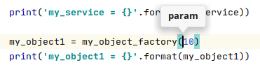

Wirinj
======
A comfy dependency injection library for Python 3.

Why choose wirinj
-----------------------------------------

- Minimal boiler plate code.
- Injection via `__init__` or via _attributes_.
- Dependencies automatically detected through [reflection](https://en.wikipedia.org/wiki/Reflection_(computer_programming)#Python).
- No naming conventions required.
- [No factories needed](#factories) to create new instances.
- Friendly with [IDE](https://en.wikipedia.org/wiki/Integrated_development_environment) 's [code completion](https://www.jetbrains.com/help/pycharm/auto-completing-code.html#) (e.g. with [PyCharm](https://www.jetbrains.com/pycharm/)).
- [Autowiring](#autowiring) option.
- [Injection reports](#injection-reports) to easily debug dependency problems.
- Simple but powerful wiring configuration.
- Open and extendable architecture.

Installation
------------

Python >= `3.6`

Tested with Python `3.6`, `3.7` and `3.8`.

```shell
$ pip install wirinj
```

Table of Contents
=================

  * [How to use it](#how-to-use-it)
  * [Code completion on the IDE](#code-completion-on-the-ide)
  * [Injection types](#injection-types)
     * [Into attributes](#into-attributes)
     * [Into __init__ arguments](#into-__init__-arguments)
  * [Factories](#factories)
  * [Dependency definitions](#dependency-definitions)
     * [Definition format](#definition-format)
     * [dict keys](#dict-keys)
     * [dict values](#dict-values)
     * [Custom dependency builders](#custom-dependency-builders)
     * [Configuring injection for specific classes](#configuring-injection-for-specific-classes)
     * [Custom-built dependencies](#custom-built-dependencies)
     * [Custom-built dependencies with arguments](#custom-built-dependencies-with-arguments)
     * [Split definitions](#split-definitions)
  * [Autowiring](#autowiring)
     * [Heuristic rules](#heuristic-rules)
     * [Autowiring for production](#autowiring-for-production)
     * [Autowiring report](#autowiring-report)
     * [<em>No singletons</em> option](#no-singletons-option)
  * [Injection reports](#injection-reports)
     * [Debugging the injection](#debugging-the-injection)
     * [Missing dependencies](#missing-dependencies)
     * [Instance error](#instance-error)
  * [A complete injection example](#a-complete-injection-example)


How to use it
-------------

Example ([autowiring.py](examples/basic/autowiring.py)):

```python
...

class MyService:
    ...

class MyObject:
    my_service: MyService = INJECTED
    my_config: str = INJECTED

    def __init__(self, param):
        ...


config = {
    'my_config': 'some conf',
}


# Use a function to get access to the root dependencies
@inject(Definitions(config), Autowiring())
def do(
        my_service: MyService,
        my_object_factory: Type[MyObject]
):
    print(my_service)

    my_object1 = my_object_factory(10)
    print(my_object1)


# Inject and run it
do()
```
Output:
```
my_service = <MyService>
my_object1 = <MyObject> -> my_config: "some conf", param: 10, my_service: <MyService>
```
### Explanation of the example above
`MyService` and `MyObject` are the two user classes.

Attributes `my_service` and `my_config` are set with the constant `INJECTED` to indicate that they must be injected.

The function named `do`, or any other name you choose, will contain the code inside the injection context with access to any required dependency. This function is decorated with `@inject` which will inject the dependencies into the function parameters. `@inject` takes as arguments one or more dependency sources. In this case, a `Definition` for the static config values and an `Autowiring` to automatically instantiate the required objects. `wirinj` will use this ordered list of sources to locate any required dependency.

As the first parameter in the function `do` (`my_service`) is not defined in the first source (`config`), the dependency will be requested to the second one (`Autowiring`) which will lazily instantiate a `MyService` object. The class is inferred from the type annotation of the parameter. By default `Autowiring` will make the object a singleton and therefore any subsequent request for this class will get the same unique instance. 

The second parameter (`my_object_factory`) is annotated as `Type[MyObject]`. `Type[]` is part of the standard  [typing](https://docs.python.org/3/library/typing.html#typing.Type) library. It indicates that the parameter is not expected to contain an object of class `MyObject` but the class `MyObject` itself or a subclass of it. Therefore you may use `my_object_factory` variable the same way you would use `MyObject` class. In the body of the function `do`, this parameter is called to instantiate a new `MyObject`. By calling `my_object_factory` instead of `MyObject` you make `wirinj` to inject all its required dependencies during the instantiation:
 ```python
# This instantiate a MyObject but, as expected, nothing is injected.
obj = MyObject(10)

# This is the same but its dependencies are automatically injected BEFORE running __init__ 
obj = my_object_factory(10)
```

The last line runs the function `do` with no parameters. The `@inject` decorator will inject them from the dependency sources.

Code completion on the IDE
--------------------------

If you are using an [IDE](https://en.wikipedia.org/wiki/Integrated_development_environment) such as [PyCharm](https://www.jetbrains.com/pycharm/), you will notice that [code completion](https://www.jetbrains.com/help/pycharm/auto-completing-code.html#) will work as expected in the previous example even for the factory.




Injection types
---------------

### Into attributes

Example ([attribute_injection.py](examples/injection_types/attribute_injection.py)):

```python
class Cat:
    feeder: Feeder = INJECTED

    def __init__(self, color, weight):
        ...

@inject(...)
def fn(factory: Type[Cat]):
    cat = factory('blue', 12)
```

When you call the factory:
 0. The attributes set to `INJECTED` are located and injected.
 0. The `__init__` method is called.


### Into `__init__` arguments

Example ([init_injection.py](examples/injection_types/init_injection.py)):

```python
class Cat:
    def __init__(self, color, weight, feeder: Feeder = INJECTED):
        ...

@inject(...)
def fn(factory: Type[Cat]):
    cat = factory('blue', 12)
...
```

- `color` and `weight` are passed to `__init__`.
- `feeder` is injected.

For `__init__` injections, it is not required to set `INJECTED` as a default value. Any missing argument not passed to the constructor will be injected too. This way you can inject into third party classes whose code is not under your control. However, if you can assign `INJECTED` as a default value, the IDE won't complain about a missing argument and at the same time you will get a `MissingDependenciesError` if the dependency is missing which is helpful to early detect dependency issues.

Factories
---------
I have already explained in the [first example](#how-to-use-it) of this README how to use factories. Now, I'm going to elaborate on that a little more.

Pay attention to the function `func` and its argument `cat_class` in this example:

```python
from typing import Type

class Cat:
    pass

class BlackCat(Cat):
    pass

def func(cat_class: Type[Cat]):
    return cat_class()

print('Cat: ', func(Cat))
print('BlackCat: ', func(BlackCat))
```

Output:
```
Cat:  <__main__.Cat object at 0x7fc458bc7588>
BlackCat:  <__main__.BlackCat object at 0x7fc458bc7588>
```

Note that you pass a class and not an object as an argument.

`Type[Cat]`, as described in the [typing](https://docs.python.org/3/library/typing.html#typing.Type) library docs, represents the class `Cat` or a subclass of it. A parameter annotated with `Type[]` expects to receive a class and not an object. In the body of the function, the parameter can be used the same way as its subscribed class would be used.

Example ([factory.py](examples/basic/factory.py)):

```python
from typing import Type

class Cat:
    def __init__(self, sound):
        ...

@inject(...)
def fn(cat_factory: Type[Cat]):
    cat = cat_factory('Meow')
    print('cat:', cat)

fn()
```
By using the `Type[]` annotation, the IDE recognizes the parameter as it was the original class but with the difference that any newly created object will be automatically injected.

 ```python
# This instantiate a Cat object but, as expected, nothing is injected.
cat = Cat('Meow')

# This is the same but its dependencies are automatically injected BEFORE running __init__ 
cat = cat_factory('Meow')
```

You have both things: the injection is enabled and the IDE completion is fully functional:


Dependency definitions
----------------------

In previous examples, the wiring configuration has been relegated to the automatic `Autowiring` class. However you will gain control by explicity defining how your dependencies have to be met. The general way to do this would be something like this:

```python
defs = {
    Cat: Instance(),
    'dog': Singleton(Dog),
}

@inject(Definitions(defs))
```

The `Definitions` class allows you to configure the wiring of your classes according to one or more definition `dict` parameters (`defs` in the example). The first definitions take precedence.

### Definition format

One or several `dict` arguments passed to the `Definition` class define your dependency configuration. 
Each _key_ represents an argument being injected.
The _value_ represents how is it injected:

### dict keys

- If the _key_ is a `class`, it will match the argument's __type__ annotation.
E.g.: the first key in the example above causes any argument of type `Cat`, no matter its name, to be injected with a new _instance_ of `Cat`.

- If the _key_ is a `string` it will match the argument __name__.
E.g.: the second key causes any argument with name `'dog'` to be injected with a unique `Dog` instance.
Here, as the class can't be inferred from the key, you need to explicitly provide the class as an argument: `'dog': Singleton(Dog)`.  

### dict values

Each _value_ in the `dict` can be:

- A _literal_ value you want to be injected. E.g. `'db_name': 'my-db'`.
- `Instance`: inject a new instance each time.
- `Singleton`: inject the same unique instance every time.
- `Factory`: inject a factory object that can be called to create new injected objects dynamically.
- `CustomInstance`: similar to `Instance` but you provide a custom function to have full control over instantiation.
- `CustomSingleton`: similar to `Singleton` but you provide a custom function which will create the object.
- Any other user defined subclasses of `DependencyBuilder` or `Dependency`.

Example ([definition_types.py](examples/basic/definition_types.py)):

```python
class House:
    pass


class Cat:
    pass


class Dog:
    pass


def dog_builder():
    """ Custom instantiation """
    dog = Dog()
    dog.random = randint(50, 100)
    return dog


defs = {
    House: Singleton(),
    Cat: Instance(),
    Type[Cat]: Factory(),
    Dog: CustomInstance(dog_builder),
    Type[Dog]: Factory(),
}


@inject(Definitions(defs))
def fn(house: House, cat_factory: Type[Cat], dog_factory: Type[Dog]):
    cat = cat_factory()
    dog = dog_factory()

    print('house:', house)
    print('cat:', cat)
    print('dog:', dog)


fn()
```

### Custom dependency builders 

`Instance`, `Singleton` and `Factory` accept an optional class argument to indicate the class of the object to be created.
There are two use cases where you need to pass the class:
- The _key_ is a `string` and therefore the dependency class is undefined.
- The attribute or argument being injected is annotated with a _base class_ but you want to provide a specific _subclass_ of it.

Example of both use cases ([explicit_class.py](examples/basic/explicit_class.py)):

```python
class Pet:
    pass
    
class Cat(Pet):
    pass
    
class Dog(Pet):
    pass

defs = {
    'cat': Singleton(Cat),
    Pet: Singleton(Dog),
}

@inject(Definitions(defs))
def fn(cat, pet: Pet):
    print('cat is a', cat.__class__.__name__)
    print('pet is a', pet.__class__.__name__)    
fn()
```

Output:
```
cat is a Cat
pet is a Dog
```

### Configuring injection for specific classes 

```python
class Nail:
    pass
    
class Leg:
    def __init__(self, nail: Nail):
        pass
    
class Cat:
    def __init__(self, leg: Leg):
        pass
```

Imagine `wirinj` is injecting a `Cat` which requires a `Leg` which requires a `Nail`.
The injector will gather:
 - First, the `Nail` that has no dependencies.
 - Then, the `Leg` with the `Nail` as an argument.
 - Finally, the `Cat` with the `Leg` as an argument.

We can think of this process as a path: `Cat` -> nail:`Nail` -> leg:`Leg`.
I call this the `instantiation path`. 

You can explicitly specify a `instantiation path` constraint in the definition `dict`.

Example ([instantiation_path.py](examples/basic/instantiation_path.py)):

```python
class Animal:
    def __init__(self, sound):
        self.sound = sound

class Dog(Animal):
    pass
    
class Cat(Animal):
    pass

class Cow(Animal):
    pass

defs = {
    Dog: Instance(),
    Cat: Instance(),
    Cow: Instance(),

    (Dog, 'sound'): 'woof',
    (Cat, 'sound'): 'meow',
    'sound': '?',
}

@inject(Definitions(defs))
def fn(cat: Cat, dog: Dog, cow: Cow):
    print('Cat:', cat.sound)
    print('Dog:', dog.sound)
    print('Cow:', cow.sound)

fn()
```

Output:

```
Cat: meow
Dog: woof
Cow: ?
```

To restrict a definition entry to a particular `instantiation path` we use a `tuple` in the __key__ part.
This `tuple` must match the last entries in the `instantiation path`.

For each `tuple` entry, a `string` refers to the argument __name__ and a `class` refers to the argument __type__ annotation. 

If two entries match the required dependency, the more specific one will be chosen.

### Custom-built dependencies

`Instance` and `Singleton` are used for simple class instantiation.
When a custom process is required to create or locate the dependency, use `CustomInstance` or `CustomSingleton`.
Both take a `function` as an argument.

Example ([custom_build.py](examples/basic/custom_build.py)):

```python
from random import randint

from wirinj import CustomInstance, inject, Definitions


class Cat:
    def __init__(self, color, weight):
        self.color = color
        self.weight = weight

    def __str__(self):
        return f'A {self.color} pounds {self.weight} cat.'


def create_cat(color):
    return Cat(color, randint(4, 20))


defs = {
    'color': 'blue',
    Cat: CustomInstance(create_cat),
}


@inject(Definitions(defs))
def fn(cat1: Cat, cat2: Cat, cat3: Cat):
    print(cat1)
    print(cat2)
    print(cat3)


fn()
```

Output:

```
A 11 pounds blue cat.
A 5 pounds blue cat.
A 14 pounds blue cat.
```


### Custom-built dependencies with arguments

In the previous example, the object is instantiated without arguments,
so all of its `__init__` arguments are injected from dependencies.

If your constructor requires some arguments to be passed (__explicit arguments__) and others to be injected (__injection arguments__),
I recommend to follow these rules:

0. In the `__init__` method, put the _explicit arguments_ first and then the _injection arguments_.
This allow you to use positional arguments when you create the object.

0. Set the default value of the _injection arguments_ to `INJECTED`.
This way the IDE [code completion](https://www.jetbrains.com/help/pycharm/auto-completing-code.html#) will not complain about missing arguments.
Also, this is the only way you can have defaults in your _explicit arguments_ when they are followed by _injection arguments_. 

0. About the builder function that you pass to `CustomInstance`, use the same name and position for the _explicit arguments_ as you use in the `__init__` method. 
The rest of the arguments don't have to be related at all to the `__init__` arguments.
Indeed, you can specify as many dependency arguments as you need to create the object.
The injection process will inspect the function signature and will provide them.

Example ([custom_build_with_args.py](examples/basic/custom_build_with_args.py)):

```python
from random import randint
from typing import Type

from wirinj import CustomInstance, Factory, inject, Definitions


class Cat:
    def __init__(self, name, color=None, weight=None):
        self.name = name
        self.color = color
        self.weight = weight

    def __str__(self):
        return f'{self.name} is a {self.color} pounds {self.weight} cat.'


def create_cat(name, color):
    return Cat(name, color, randint(4, 20))


defs = {
    'color': 'black',
    Cat: CustomInstance(create_cat),
    Type[Cat]: Factory(),
}


@inject(Definitions(defs))
def fn(factory: Type[Cat]):
    cat = factory('Tom')
    print(cat)
    cat2 = factory('Sam')
    print(cat2)


fn()
```

Output:
```
Tom is a 8 pounds black cat.
Sam is a 14 pounds black cat.
```

About the 3 arguments of `Cat`.`__init__`:
- One comes from calling the factory.
- Another one from the dependency configuration.
- The third is generated by the custom creation function.


### Split definitions

You can split the dependency configuration in several `dict` definitions.

Example ([split_definitions.py](examples/basic/split_definitions.py)):

```python
class Cat:
    sound: str = INJECTED
    weight: float = INJECTED

config = {
    'sound': 'meow',
    'weight': 5,
}

wiring = {
    Cat: Instance(),
    Type[Cat]: Factory()
}

@inject(Definitions(config, wiring))
def fn(...):
    ...
```

`Definitions` accepts any number of definition `dict`s.


Autowiring
----------

You can add an `Autowiring` instance as a last resort to provide a dependency when it is undefined.
The automatically created dependency will be of type `Instance`, `Singleton` or `Factory` dependening on the context.

Example ([autowiring.py](examples/basic/autowiring.py)):

```python
class MyService:
    def __str__(self):
        return '<MyService>'


class MyObject:
    my_service: MyService = INJECTED
    my_config: str = INJECTED
    ...    
    
    def __init__(self, param):
        self.param = param


config = {
    'my_config': 'some conf',
}


# Use a function to get access to the root dependencies
@inject(Definitions(config), Autowiring())
def do(
        my_service: MyService,
        my_object_factory: Type[MyObject]
):
    print(my_service)

    my_object1 = my_object_factory(10)
    print(my_object1)


# Inject and run it
do()
```

Output:

```
<MyService>
<MyObject> -> my_config: "some conf", param: 10, my_service: <MyService>
```

`my_config` is the only dependency explicitly defined. The 3 others fall back to `Autowiring` which will automatically create:
- A `MyService` singleton.
- A `Type[MyObject]` factory.
- A `MyObject` instance when the factory is called.

### Heuristic rules

`Autowiring` works only for arguments that have a _type annotation_:
- If the annotation is a `class`, as with `dog: Dog` in the previous example, a _singleton_ will be generated.
- If it is `Type[class]`, as with `horse_factory: Type[Horse]`, a _factory_ will be provided.
- If the injection comes from a factory, as when `horse_factory()` is called, an _instance_ will be created.

### Autowiring for production

In my opinion, this kind of _magic_ should not be used in production environments;
you should not take the risk of leaving such important wiring decisions in the hands of an heuristic algorithm.

Fortunately, you can use `AutowiringReport` class to easily convert the autowiring configuration into a regular dependency definition:

### Autowiring report

It's quite simple to use; just pass an `AutowiringReport` instance to `Autowiring`:

Example ([autowiring_report.py](examples/report/autowiring_report.py)):

```python
report = AutowiringReport()

@inject(Definitions(deps), Autowiring(report))
def fn(cat: Cat, dog: Dog, horse_factory: Type[Horse]):
    ...    

fn()

print(report.get())
```

Output:
```
...
--------------- wirinj ---------------
Autowiring report:

Definitions({
    Dog: Singleton(),
    Type[Horse]: Factory(),
    Horse: Instance(),
}),
--------------------------------------
```

Call `report.get()` to get the report.
Review and copy the definitions to your configuration file, remove `Autowiring`, and you will be production ready.
  
### _No singletons_ option

You may set `use_singletons` to `False` to force all dependencies to be injected as an `Instance`.

```python
Autowiring(use_singletons=False)
```
  

Injection reports
-------------------

During each injection process, a _dependency tree_ is built with all the dependencies that are being gathered.

As you change your code, your dependency configuration can get out of sync.
`wirinj` include reporting features that can help you to solve this dependency issues:

### Debugging the injection

The injection process can be debugged to expose the creation order and the _dependency tree_.

Take this composition of classes ([cat_example_classes.py](examples/report/cat_example_classes.py)) :

```python
class Nail:
    pass

class Leg:
    def __init__(self, nail1: Nail, nail2: Nail, nail3: Nail, nail4: Nail, nail5: Nail):
        pass

class Mouth:
    pass

class Ear:
    pass

class Eye:
    pass

class Head:
    def __init__(self, mouth: Mouth, ear1: Ear, ear2: Ear, eye1: Eye, eye2: Eye):
        pass

class Body:
    pass

class Tail:
    pass

class Cat:
    def __init__(self, head: Head, body: Body, tail: Tail, leg1: Leg, leg2: Leg, leg3: Leg, leg4: Leg):
        pass
```

We can debug the injection process just by setting the logging level to `DEBUG` and then, requesting a `Cat` from the `Injector`:

Example ([injection_debug_report.py](examples/report/injection_debug_report.py)):

```python
import logging

logging.basicConfig(level=logging.DEBUG, format='%(message)s')

inj = Injector(Autowiring(use_singletons=False))

cat = inj.get(Cat)
```
Note that we are replacing all the dependency definitions by a simple `Autowiring()`.
We pass the argument `use_singletons=False` to force all dependencies to be injected as an `Instance`.
By default `Autowiring` generates `Singleton` dependencies and, in this case, we don't want all the legs of the `Cat` to be the same.

The code above returns this:
```
--------------- wirinj ---------------
        mouth:Mouth
        ear1:Ear
        ear2:Ear
        eye1:Eye
        eye2:Eye
    head:Head
    body:Body
    tail:Tail
        nail1:Nail
        nail2:Nail
        nail3:Nail
        nail4:Nail
        nail5:Nail
    leg1:Leg
        nail1:Nail
        nail2:Nail
        nail3:Nail
        nail4:Nail
        nail5:Nail
    leg2:Leg
        nail1:Nail
        nail2:Nail
        nail3:Nail
        nail4:Nail
        nail5:Nail
    leg3:Leg
        nail1:Nail
        nail2:Nail
        nail3:Nail
        nail4:Nail
        nail5:Nail
    leg4:Leg
:Cat
--------------------------------------
```
You can see how all the dependencies are gathered, and in which order.
The final object is the requested `Cat` object.

### Missing dependencies

Injection doesn't stop when a dependency is missing.
It continues building the _dependency tree_ as far as it can.
This makes it possible to fix several dependency issues in one shot.

If one ore more dependencies are missing, an `ERROR` level report will be logged.
Therefore, you don't need to change the `logging` level to get it; just look above the _error traceback_ after a dependency exception.

Example ([missing_dependencies_report.py](examples/report/missing_dependencies_report.py)):

```python
    from examples.report.cat_example_classes import Cat, Head
    from wirinj import Injector, Definitions, Instance
    
    inj = Injector(Definitions({
        Cat: Instance(),
        Head: Instance(),
    }))
    cat2 = inj.get(Cat)
```

In the example above, we only define the wiring for `Cat` and `Head`.
All the other dependencies, such as `Mouth`, `Ear`, `Eye`, etc, are undefined.

After running the example, we get:
```
--------------- wirinj ---------------
Missing dependencies:
        mouth:Mouth *** NotFound ***
        ear1:Ear *** NotFound ***
        ear2:Ear *** NotFound ***
        eye1:Eye *** NotFound ***
        eye2:Eye *** NotFound ***
    head:Head
    body:Body *** NotFound ***
    tail:Tail *** NotFound ***
    leg1:Leg *** NotFound ***
    leg2:Leg *** NotFound ***
    leg3:Leg *** NotFound ***
    leg4:Leg *** NotFound ***
:Cat
--------------------------------------
Traceback (most recent call last):
...
wirinj.errors.MissingDependenciesError: Missing dependencies.
```

Notice that, although the first dependency, `Mouth`, failed to be satisfied, the injection process continues in order to gather as much information as possible about the missing dependencies.

With this report, it becomes clear which classes are undefined, and what needs to be added in the injection configuration.

### Instance error

If an exception is raised during the instantiation of any of the dependencies,
you will not get the `dependency tree` logs as it happens when a dependency is missing.

You'll need to track the stack trace to fix the problem.
However, there is a task planned in the [TO-DO](TODO.md) list to log the `dependency tree` in these cases too.


### A complete example

This silly example aims to illustrate several aspects of the `wirinj` library.

The two main classes, `Bob` and `Mike`, extend `PetDeliveryPerson`.
They are used to deliver pets to the client using one or more vehicles.
Whenever a `Vehicle` is needed, it is built in advance.

While `Bob` uses his only vehicle by repeating the route several times, `Mike` builds a fleet of autonomous vehicles to deliver all the pets in one trip.

The classes ([pet_delivery/classes.py](examples/pet_delivery/classes.py)):

```python
class Pet:
    def __deps__(self, sound: str, weight):
        self.sound = sound
        self.weight = weight

    @deps
    def __init__(self, gift_wrapped):
        self.gift_wrapped = gift_wrapped

    def cry(self):
        return self.sound.lower() if self.gift_wrapped else self.sound.upper()


class Cat(Pet):
    pass


class Dog(Pet):
    pass


class Bird(Pet):
    pass


class Part:
    def __deps__(self, mount_sound):
        self.mount_sound = mount_sound

    @deps
    def __init__(self):
        pass

    def mount(self):
        return self.mount_sound


class Engine(Part):
    pass


class Plate(Part):
    pass


class Wheel(Part):
    pass


class Container(Part):
    pass


class VehicleBuilder:

    def __deps__(self,
                 engine_factory: Type[Engine],
                 plate_factory: Type[Plate],
                 wheel_factory: Type[Wheel],
                 container_factory: Type[Container],
                 ):
        self.engine_factory = engine_factory
        self.plate_factory = plate_factory
        self.wheel_factory = wheel_factory
        self.container_factory = container_factory

    @deps
    def __init__(self):
        pass

    def build(self, recipe: Dict):
        parts = []  # type: List[Part]
        parts += [self.engine_factory() for _ in range(recipe.get('engines', 0))]
        parts += [self.plate_factory() for _ in range(recipe.get('plates', 0))]
        parts += [self.wheel_factory() for _ in range(recipe.get('wheels', 0))]
        parts += [self.container_factory() for _ in range(recipe.get('containers', 0))]

        mounting = ''
        for part in parts:
            mounting += ' ' + part.mount()

        return mounting


class Vehicle:
    def __deps__(self, builder: VehicleBuilder, recipe: Dict, max_load_weight):
        self.builder = builder
        self.recipe = recipe
        self.max_load_weight = max_load_weight

    @deps
    def __init__(self):
        self.pets = []
        self.build()

    def go(self, miles):
        logger.info('{} goes {} miles'.format(self.__class__.__name__, miles))

    def come_back(self):
        logger.info('{} commes back'.format(self.__class__.__name__))

    def build(self):
        logger.info('{} is built: {}'.format(
            self.__class__.__name__,
            self.builder.build(self.recipe)
        ))

    def get_available_load(self):
        return self.max_load_weight - sum(pet.weight for pet in self.pets)


class Car(Vehicle):
    pass


class Van(Vehicle):
    pass


class Truck(Vehicle):
    pass


class PetLoader:

    def upload(self, pets: List[Pet], vehicle: Vehicle):
        info = 'Uploading to the {}:'.format(vehicle.__class__.__name__.lower())
        while pets:
            pet = pets.pop()
            if vehicle.get_available_load() >= pet.weight:
                vehicle.pets.append(pet)
                info += ' ' + pet.__class__.__name__
            else:
                pets.append(pet)
                break
        logger.info(info)

    def download(self, vehicle):
        logger.info('{} pets delivered'.format(len(vehicle.pets)))
        vehicle.pets = []


class PetPicker:

    def __deps__(self, pet_store: Type[Pet]):
        self.pet_store = pet_store

    @deps
    def __init__(self):
        # raise Exception('HORROR!!!!')
        pass

    def pick(self, qty, gift_wrapped):
        info = 'Picking pets up: '
        pets = []
        for _ in range(qty):
            pet = self.pet_store(gift_wrapped)
            info += ' ' + pet.cry()
            pets.append(pet)
        logger.info(info)
        return pets


class PetDeliveryPerson:

    @deps
    def __init__(self):
        pass

    def deliver(self, pet_qty, miles, gift_wrapped):
        pass


class Bob(PetDeliveryPerson):
    """Bob builds a car and deliver pets in his vehicle repeating the route several times."""

    def __deps__(self, vehicle: Vehicle, pet_picker: PetPicker, pet_loader: PetLoader):
        self.vehicle = vehicle
        self.pet_picker = pet_picker
        self.pet_loader = pet_loader

    def deliver(self, pet_qty, miles, gift_wrapped):
        # Pick up pets
        pets = self.pet_picker.pick(pet_qty, gift_wrapped)

        # Bob owns one vehicle only
        while pets:
            self.pet_loader.upload(pets, self.vehicle)
            self.vehicle.go(miles)
            self.pet_loader.download(self.vehicle)
            self.vehicle.come_back()


class Mike(PetDeliveryPerson):
    """Mike builds several autonomous vehicles and use them to deliver the pets all together"""

    def __deps__(self, vehicle_factory: Type[Vehicle], pet_picker: PetPicker, pet_loader: PetLoader):
        self.vehicle_factory = vehicle_factory
        self.pet_picker = pet_picker
        self.pet_loader = pet_loader

    @deps
    def __init__(self):
        super().__init__()
        self.vehicles = []  # type: List[Vehicle]

    def get_vehicle(self):
        if self.vehicles:
            return self.vehicles.pop()
        else:
            return self.vehicle_factory()

    def park_vehicles(self, vehicles):
        self.vehicles += vehicles

    def deliver(self, pet_qty, miles, gift_wrapped):

        # Pick up pets
        pets = self.pet_picker.pick(pet_qty, gift_wrapped)

        # Get vehicles and upload them
        vehicles = []
        while pets:
            vehicle = self.get_vehicle()
            vehicles.append(vehicle)
            self.pet_loader.upload(pets, vehicle)

        # Go
        for vehicle in vehicles:
            vehicle.go(miles)

        # Deliver pets
        for vehicle in vehicles:
            self.pet_loader.download(vehicle)

        # Come back
        for vehicle in vehicles:
            vehicle.come_back()

        # Park
        self.park_vehicles(vehicles)
```

Injection definitions ([pet_delivery/defs.py](examples/pet_delivery/defs.py)):

```python
pet_defs = {
    Dog: Instance(),
    Cat: Instance(),
    Bird: Instance(),

    (Dog, 'sound'): 'Woof',
    (Dog, 'weight'): 10,

    (Cat, 'sound'): 'Meow',
    (Cat, 'weight'): 5,

    (Bird, 'sound'): 'Chirp',
    (Bird, 'weight'): 0.1,
}


vehicle_defs = {
    Engine: Instance(),
    Plate: Instance(),
    Wheel: Instance(),
    Container: Instance(),

    Type[Engine]: Factory(),
    Type[Plate]: Factory(),
    Type[Wheel]: Factory(),
    Type[Container]: Factory(),

    VehicleBuilder: Singleton(),

    (Engine, 'mount_sound'): 'RRRRoarrr',
    (Plate, 'mount_sound'): 'plaf',
    (Wheel, 'mount_sound'): 'pffff',
    (Container, 'mount_sound'): 'BLOOOOM',

    Car: Instance(),
    (Car, 'max_load_weight'): 10,
    (Car, 'recipe'): {
        'engines': 1,
        'plates': 6,
        'wheels': 4,
    },

    Van: Instance(),
    (Van, 'max_load_weight'): 50,
    (Van, 'recipe'): {
        'engines': 1,
        'plates': 8,
        'wheels': 4,
    },

    Truck: Instance(),
    (Truck, 'max_load_weight'): 200,
    (Truck, 'recipe'): {
        'engines': 1,
        'plates': 20,
        'wheels': 12,
        'container': 1,
    },
}

common_defs = {
    PetPicker: Singleton(),
    PetLoader: Singleton(),

    Bob: Singleton(),
    Mike: Singleton(),
}
```
       
Running the app ([pet_delivery/example_1.py](examples/pet_delivery/example_1.py)):

```python
world_one_defs = {
    (Bob, Vehicle): Singleton(Car),
    (Bob, PetPicker, Type[Pet]): Factory(Bird),

    (Mike, Type[Vehicle]): Factory(Van),
    (Mike, PetPicker, Type[Pet]): Factory(Cat),
}

world_one = Definitions(
    pet_defs,
    vehicle_defs,
    common_defs,
    world_one_defs,
)

logging.basicConfig(format='%(message)s', level=logging.INFO)

@inject(world_one)
def do(bob: Bob, mike: Mike):
    bob.deliver(100, 5, False)
    bob.deliver(50, 200, True)

    mike.deliver(20, 1000, True)

do()
```

Running the same app with another wiring configuration ([pet_delivery/example_2.py](examples/pet_delivery/example_2.py)):

```python
world_two_defs = {
    (Bob, Vehicle): Singleton(Van),
    (Bob, PetPicker, Type[Pet]): Factory(Cat),

    (Mike, Type[Vehicle]): Factory(Truck),
    (Mike, PetPicker, Type[Pet]): Factory(Dog),
}

world_two = Definitions(
    pet_defs,
    vehicle_defs,
    common_defs,
    world_two_defs,
)

logging.basicConfig(format='%(message)s', level=logging.INFO)

@inject(world_two)
def do(bob: Bob, mike: Mike):
    bob.deliver(100, 5, False)
    bob.deliver(50, 200, True)

    mike.deliver(20, 1000, True)

do()
```
